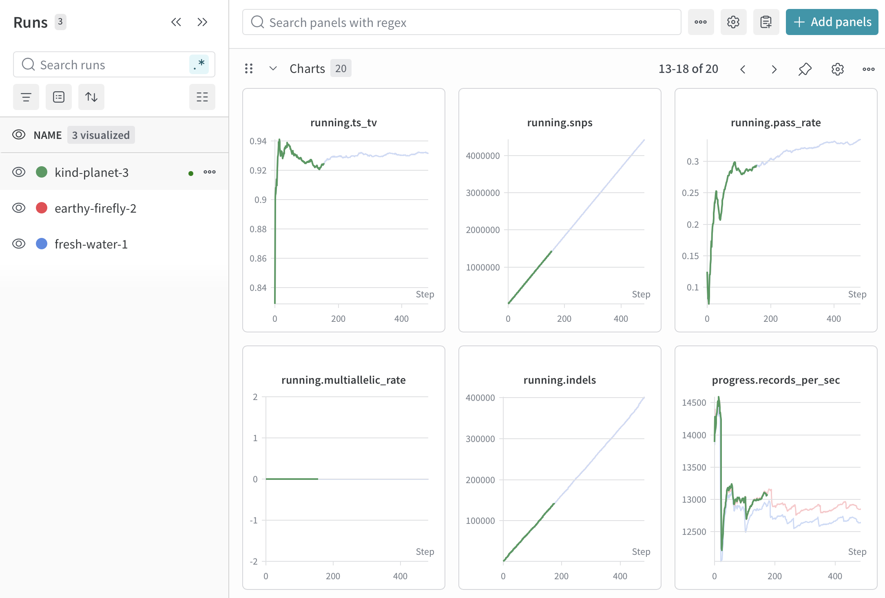

<p align="center">
  
</p>

# magicwand

Drop-in W&B instrumentation for WDL bash command blocks. Two lines in
your task and you get a Weights & Biases run with system metrics, a
per-command resource breakdown, and a clickable URL — without modifying
your tool, your docker image, or your Cromwell backend.

## Tier 0 — instrument any WDL task in two lines

```wdl
task vcf_quickstats {
  input {
    File vcf
    String? wandb_api_key
  }
  command <<<
    set -euo pipefail
    apt-get update -qq && apt-get install -y -qq bcftools

    ~{"export WANDB_API_KEY=" + wandb_api_key}
    source <(curl -fsSL https://raw.githubusercontent.com/broadinstitute/magicwand/main/install.sh)
    magicwand init

    bcftools stats ~{vcf} | tee stats.txt
  >>>
  runtime { docker: "python:3.12" memory: "4 GB" cpu: 2 }
}
```

Working example: [`examples/tier0-dropin.wdl`](./examples/tier0-dropin.wdl).

## Tier 1 — push custom metrics from inline shell

`magicwand log key=value` from anywhere in the same shell appends to
the running W&B run. Useful when you want tool-specific numbers
without writing Python:

```bash
records=$(awk '/^SN.*number of records:/ {print $NF}' stats.txt)
tstv=$(awk    '/^SN.*ts\/tv:/            {print $NF}' stats.txt)
magicwand log bcftools.records="$records" bcftools.tstv="$tstv"
```

Working example: [`examples/tier1-with-parsers.wdl`](./examples/tier1-with-parsers.wdl).

## Tier 2 — native Python, use wandb directly

When the WDL command is a Python script and you own the docker image,
skip magicwand and call `wandb.init()` yourself. wandb does
process-tree resource tracking, stdio capture, and shows the real
Python command — no shim needed. magicwand earns its keep at the
bash level, not in Python land.

Working example: [`examples/tier2-native-python/`](./examples/tier2-native-python/)
(pysam VCF stats + Dockerfile). The `running.*` and `progress.*`
metrics it streams render as live line charts in W&B:

<p align="center">
  
</p>

## W&B mode

Set `WANDB_API_KEY` (or pass `--api-key`) to get a live online run with
a clickable `wandb: View run at https://...` line. Without a key,
magicwand runs W&B offline — local files only; `wandb sync` later
from a machine that has a key. (W&B deprecated anonymous accounts in
Dec 2025, so there's no zero-config online path anymore.)

`WANDB_API_KEY` may be set to a `gs://` URL instead of the literal
key — magicwand resolves it via `gcloud storage cat` (falling back
to `gsutil cat`) before passing the value to wandb. On Terra /
Cromwell GCP the task's service account auths the read, so the key
never has to land in your workflow inputs or task log. If the read
fails for any reason, magicwand emits a warning and falls back to
offline mode.

## Known limits

| Scenario | Behavior |
|---|---|
| Pipelines `a \| b \| c` | One command on the dashboard (bash-level limit) |
| Background jobs `&` | Launch tracked, completion not |
| `docker run` inside a task | Inner container's PIDs are children of `dockerd`; resource tracking misses them |
| Bash <5.0 | Traps refuse to install (needs `EPOCHREALTIME`) |
| SIGKILL (OOM, timeout) | Sidecar may not flush; the run shows whatever was logged before the kill |

Full list: [`docs/failure-modes.md`](./docs/failure-modes.md).

## How it works

`magicwand init` writes DEBUG/ERR/EXIT bash traps that emit JSON
events on a FIFO. A backgrounded Python sidecar reads the FIFO, owns
the W&B run, samples the task PID's process tree on its own clock,
and emits a per-command summary table at finalize. WDL context
(Cromwell, miniwdl, env-var override) is detected from cwd; see
[`docs/wdl-engine-notes.md`](./docs/wdl-engine-notes.md).
